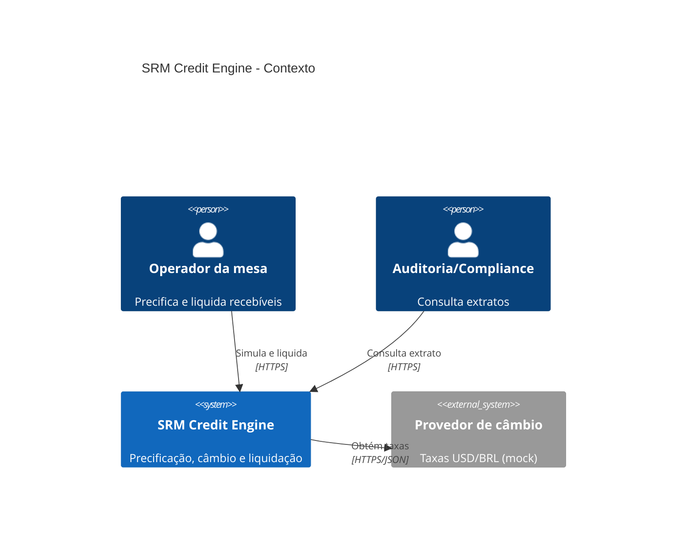
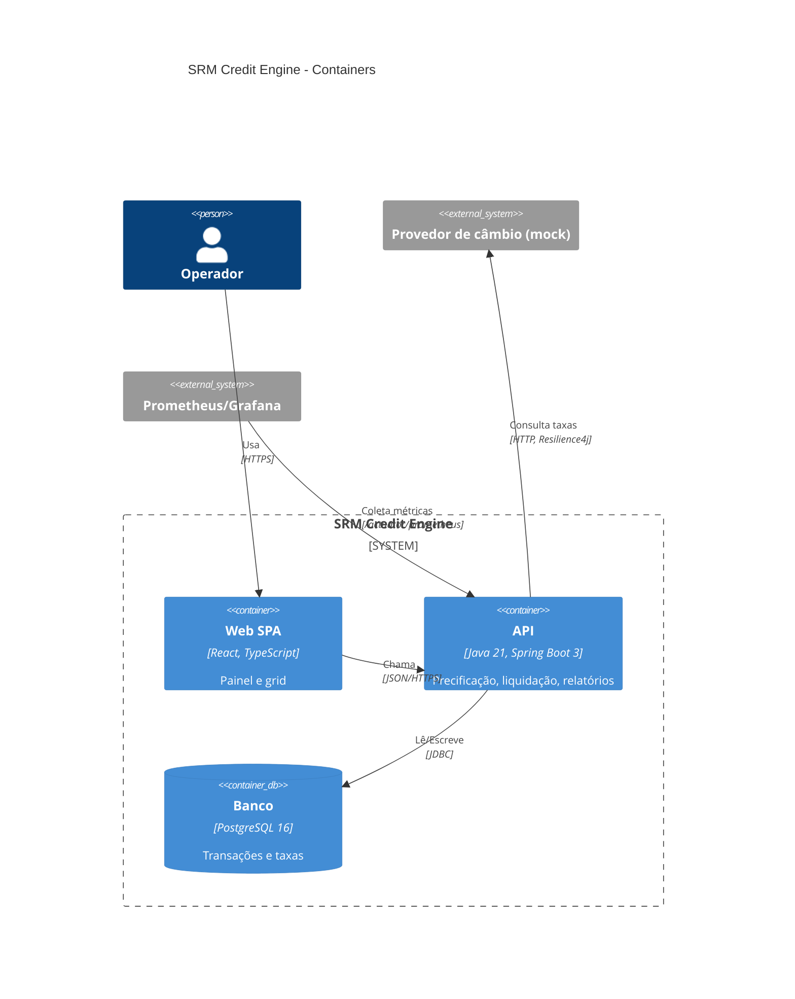
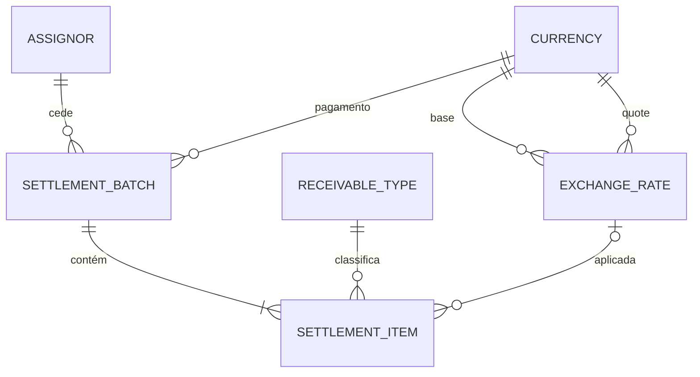

# Estrutura documental e templates

## Sumário
1. Template do README
2. Template do AI_USAGE.md
3. C4 em Mermaid
4. ER em Mermaid e DDL
5. Critérios de aceite não funcionais
6. Design de alta escala (1M tx/min)
7. Modelo de eventos (EDA)

---

## 1. Template do README

```markdown
# SRM Credit Engine

> Plataforma de cessão de crédito multimoedas: precifica recebíveis por risco, converte câmbio e liquida lotes de forma auditável.

[badges: CI, versão]

## Sumário

## 1. Visão geral
Problema de negócio em 3–4 linhas. Principais capacidades.

## 2. Como rodar
### Pré-requisitos (versões exatas)
### Subir tudo com Docker Compose
    cp .env.example .env
    docker compose up -d --build
| Serviço | URL |
|---|---|
| Frontend | http://localhost:5173 |
| API / Swagger | http://localhost:8080/swagger-ui.html |
| Prometheus / Grafana | ... |
### Rodar testes
### Desenvolvimento local sem Docker (opcional)

## 3. Stack e justificativas
| Camada | Escolha | Por quê | ADR |

## 4. Arquitetura
- C4 Contexto e Container (embed Mermaid ou link)
- Camadas e módulos (tabela curta) + como são verificados (ArchUnit)
- Padrões de projeto aplicados e onde (Strategy, Ports & Adapters, CQRS leve...)

## 5. Domínio e precificação
- Fórmula, convenção de prazo, taxa base, spreads por tipo
- Precisão numérica (BigDecimal, escalas, arredondamento)
- Câmbio: convenção do par, momento da conversão, snapshot
- Exemplo numérico resolvido

## 6. API
Tabela de endpoints (método, rota, status) + 2–3 exemplos curl. Link para Swagger.

## 7. Integridade e concorrência
ACID, optimistic locking, idempotência, teste de concorrência.

## 8. Modelo de dados
ER (link docs/database/er.md), DDL (link), índices do extrato.

## 9. Observabilidade e resiliência
Logs, métricas, tracing, circuit breaker. Como ver.

## 10. Qualidade
Testes (pirâmide), cobertura, lint, hooks, CI.

## 11. Fluxo de trabalho Git
Estratégia de branching escolhida e justificativa, Conventional Commits, PRs, rebase, tags, simulação de crise (links para PRs/commits).

## 12. Decisões arquiteturais (ADRs)
Tabela com links.

## 13. Escala e evolução
Resumo + link para docs/scale e docs/eda.

## 14. Limitações conhecidas e próximos passos

## 15. Uso de IA
Resumo + link para AI_USAGE.md.
```

## 2. Template do AI_USAGE.md

```markdown
# Uso de IA no desenvolvimento

## Ferramentas e processo
- Ferramentas (IDE, modelo), método BMAD (agentes/workflows usados), skills do repositório e como foram combinadas.
- Regra adotada: todo código gerado passa por teste, gate de verificação e revisão humana.

## Prompts estratégicos
| # | Objetivo | Prompt (resumo ou literal) | Resultado | Ajustes manuais |

## Alucinações e código inseguro detectados
### <Título curto>
- **O que a IA gerou:** ...
- **Como foi detectado:** teste / revisão / ArchUnit / skill de segurança
- **Correção:** ... (commit `abc1234`)
- **Lição:** ...

## Análise crítica
### Onde economizou tempo
### Onde atrapalhou
### O que foi feito deliberadamente sem IA e por quê
```

## 3. C4 em Mermaid




Confira nomes/tecnologias com o compose e o ADR de stack.

## 4. ER em Mermaid e DDL

- `docs/database/er.md` com `erDiagram` refletindo **exatamente** as migrações (nomes de tabela/coluna, cardinalidades).
- `docs/database/ddl.sql`: concatenação ordenada das migrações `V*` (gerável com `cat backend/src/main/resources/db/migration/V*.sql > docs/database/ddl.sql`, respeitando a ordem numérica) com cabeçalho dizendo que é gerado e qual a fonte. Alternativa: `pg_dump --schema-only` do container.



## 5. Critérios de aceite não funcionais (docs/acceptance-criteria.md)

Formato: ID, categoria, critério mensurável, como é verificado.

| ID | Categoria | Critério | Verificação |
|---|---|---|---|
| NFR-U1 | Usabilidade | Simulação exibida ≤ 500 ms após parar de digitar (p95 local) | Teste manual + métrica `srm.pricing.duration` |
| NFR-S1 | Segurança | Toda entrada validada; erro nunca expõe stack/SQL | Testes de contrato + skill de segurança |
| NFR-D1 | Desempenho | Extrato com 1M linhas, filtro por cedente+período, p95 ≤ 300 ms | `EXPLAIN ANALYZE` + teste de carga documentado |
| NFR-E1 | Escalabilidade | API stateless, escala horizontal sem sessão | Revisão de arquitetura / compose com 2 réplicas |
| NFR-I1 | Integridade | Liquidação concorrente do mesmo lote: exatamente 1 sucesso | Teste de concorrência |

## 6. Design de alta escala (docs/scale/high-scale-design.md)

Estruture: premissas e números (1M tx/min ≈ 16,7k tx/s; tamanho médio de registro; picos) → gargalos do desenho atual → arquitetura alvo:
- Ingestão assíncrona (API aceita e publica em log distribuído, ex.: Kafka particionado por cedente) com idempotência ponta a ponta.
- Workers de precificação stateless escalando horizontalmente; cache de taxas de câmbio e spreads (local + Redis) com TTL e invalidação por evento.
- Escrita particionada: sharding por cedente (ou hash do id) em PostgreSQL (Citus) ou particionamento declarativo por data; outbox pattern para eventos.
- Leitura: réplicas/OLAP (ClickHouse) alimentado por CDC para extratos; consistência eventual explicitada e SLA de defasagem.
- Garantias: exatamente-uma-vez efetivo via idempotência + chave natural; reconciliação.
- Observabilidade e capacidade: SLOs, backpressure, autoscaling por lag.
- Trade-offs e o que **não** foi implementado e por quê (YAGNI no escopo do desafio).

## 7. Modelo de eventos (docs/eda/event-model.md)

- Eventos de domínio: `ExchangeRateUpdated`, `ReceivablePriced`, `SettlementRequested`, `SettlementCompleted`, `SettlementRejected`.
- Para cada: produtor, consumidores, payload (com `eventId`, `occurredAt`, `version`, chave de partição), garantia de entrega.
- Outbox transacional como ponte do monólito atual para EDA; esquema versionado (Avro/JSON Schema) e compatibilidade.
- Diagrama de sequência Mermaid do fluxo de liquidação assíncrona.
