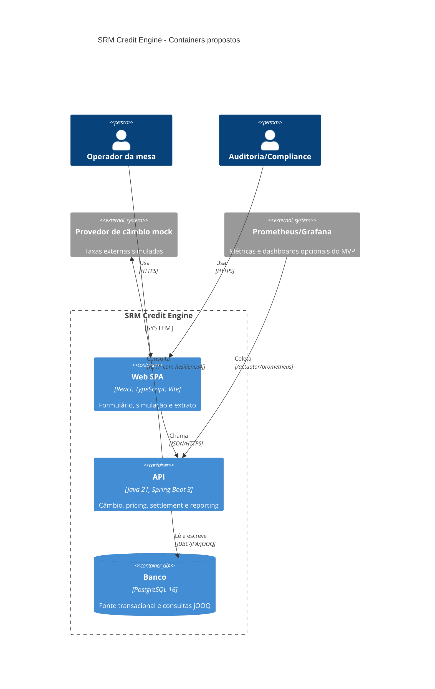

# C4 — Containers

```mermaid
C4Container
  title SRM Credit Engine - Containers propostos
  Person(operator, "Operador da mesa")
  Person(auditor, "Auditoria/Compliance")
  System_Boundary(srm, "SRM Credit Engine") {
    Container(web, "Web SPA", "React, TypeScript, Vite", "Formulário, simulação e extrato")
    Container(api, "API", "Java 21, Spring Boot 3", "Câmbio, pricing, settlement e reporting")
    ContainerDb(db, "Banco", "PostgreSQL 16", "Fonte transacional e consultas jOOQ")
  }
  System_Ext(fx, "Provedor de câmbio mock", "Taxas externas simuladas")
  System_Ext(obs, "Prometheus/Grafana", "Métricas e dashboards opcionais do MVP")
  Rel(operator, web, "Usa", "HTTPS")
  Rel(auditor, web, "Usa", "HTTPS")
  Rel(web, api, "Chama", "JSON/HTTPS")
  Rel(api, db, "Lê e escreve", "JDBC/JPA/jOOQ")
  Rel(api, fx, "Consulta", "HTTP com Resilience4j")
  Rel(obs, api, "Coleta", "/actuator/prometheus")
```

O `compose.yaml` existente já nomeia `frontend`, `backend` e `postgres`; observabilidade ainda não está configurada e permanece proposta.

