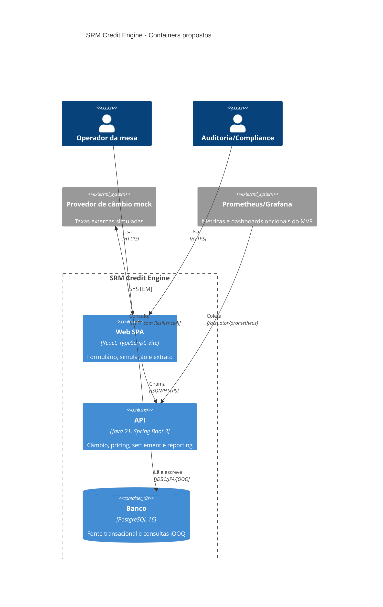

# C4 — Containers

O `compose.yaml` implementa `frontend` (`5173`), `backend` (`8080`), `postgres` (`5432`) e o provider FX WireMock (`8090`), todos com healthchecks. A SPA consulta a readiness técnica do backend em `/actuator/health/readiness`; observabilidade global permanece proposta para stories posteriores.
