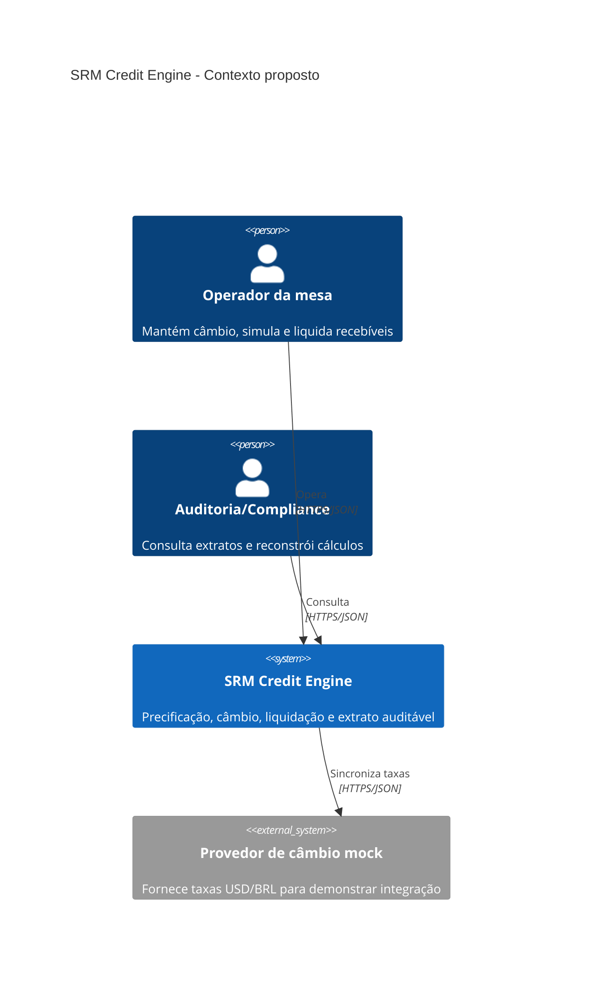

# C4 — Contexto

```mermaid
C4Context
  title SRM Credit Engine - Contexto proposto
  Person(operator, "Operador da mesa", "Mantém câmbio, simula e liquida recebíveis")
  Person(auditor, "Auditoria/Compliance", "Consulta extratos e reconstrói cálculos")
  System(srm, "SRM Credit Engine", "Precificação, câmbio, liquidação e extrato auditável")
  System_Ext(fx, "Provedor de câmbio mock", "Fornece taxas USD/BRL para demonstrar integração")
  Rel(operator, srm, "Opera", "HTTPS/JSON")
  Rel(auditor, srm, "Consulta", "HTTPS/JSON")
  Rel(srm, fx, "Sincroniza taxas", "HTTPS/JSON")
```

Kafka, Redis, Supabase e microserviços não pertencem ao contexto implementável atual.

