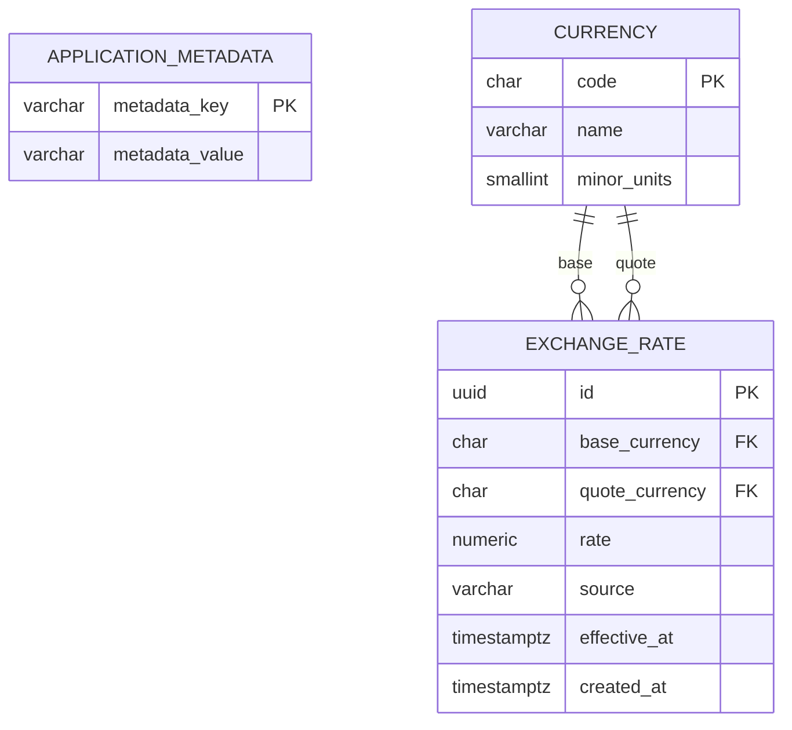
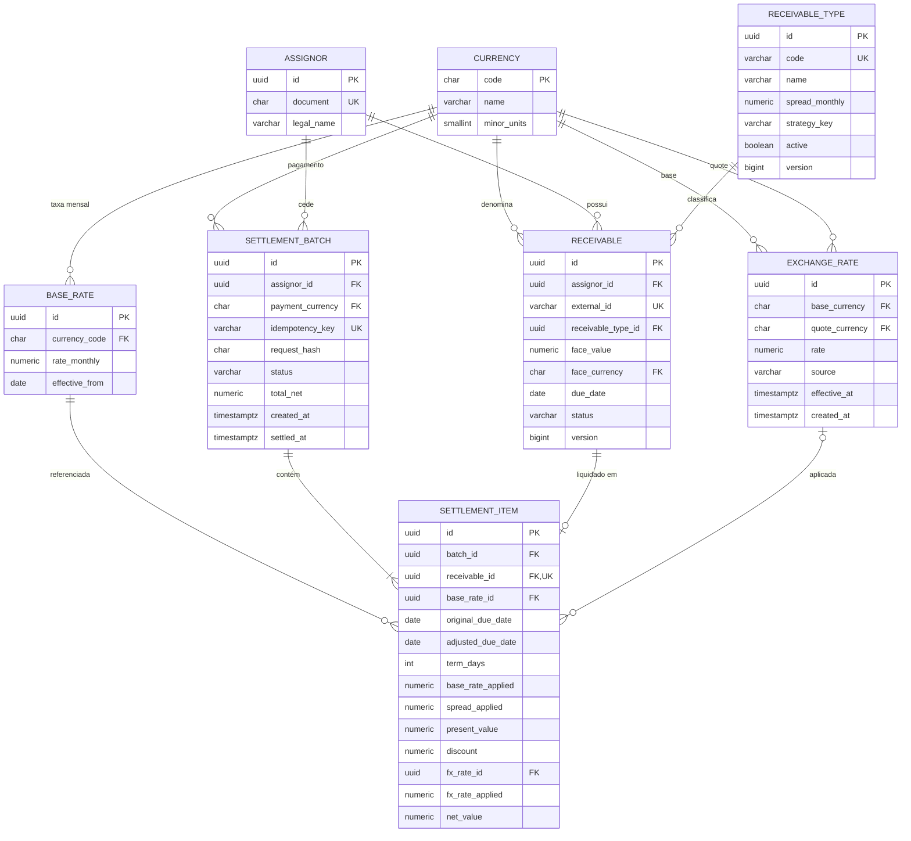

# Diagrama entidade-relacionamento

## Estado implementado até E1-S1

A fundação mantém metadados técnicos e agora inclui o catálogo USD/BRL e o histórico append-only de taxas.

O DDL vigente está em `docs/database/ddl.sql` e deriva da migration Flyway
`V1__initialize_platform.sql` e `V2__create_exchange_rates.sql`.

## Modelo de negócio aprovado para stories posteriores

Este trecho representa o planejamento aprovado, não o schema já implementado.
Ele será reconciliado incrementalmente com cada migration Flyway das stories
correspondentes.
